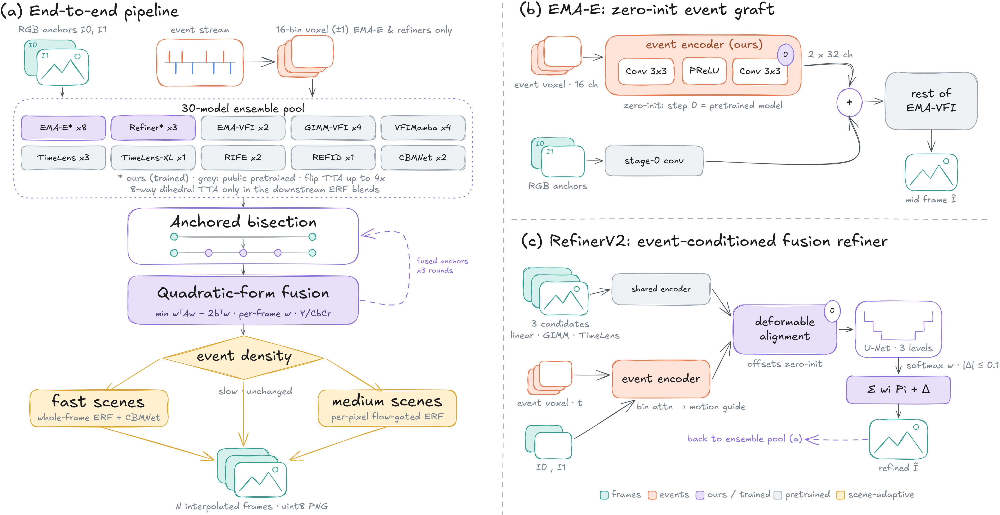

<div align="center">

# 🥇 EventAid Frame Interpolation Challenge — 1st Place Solution

### Team **yunyu8** · EBMV Workshop @ ECCV 2026 · [Codabench #16375](https://www.codabench.org/competitions/16375/)

[](#-results)
[](#-results)
[](#-quick-start)
[](#-quick-start)
[](#-model-checkpoints)

**First place on both the validation and the hidden-test leaderboards** of the
EventAid event-aided video frame interpolation challenge.

</div>

---

## 📌 TL;DR

A **30-member ensemble** built around **EMA-E** — our zero-initialized event-voxel
"graft" on EMA-VFI — combined with off-the-shelf image-only and event-based
interpolators, lightweight (~4.9M-param) learned **fusion refiners**, **ERF-X170FPS
real-event specialists**, and a per-frame **quadratic-form fusion** whose weights are
fit exclusively on the validation split. Every number in the technical report has been
re-verified by executing this release, and the rebuilt submission zip is
**bit-identical (950/950 files)** to the actually-uploaded winning entry.

## 🏆 Results

Official leaderboard scores (rank 1 on both splits):

| Split | PSNR (dB) | SSIM | Rank |
|:---|:---:|:---:|:---:|
| Validation | **43.1056** | **0.980260** | 🥇 1st |
| Hidden test | **31.8835** | **0.908784** | 🥇 1st |

## 🧠 Architecture

<div align="center">

</div>

**(a) End-to-end pipeline** — events are voxelized into signed 16-bin grids, fed to a
30-member interpolator ensemble (with self-ensemble flip TTA and anchored bisection),
fused per frame by validation-fit quadratic-form weights, then refined by
scene-adaptive ERF/CBMNet blends before uint8 PNG packaging.
**(b) EMA-E** — a zero-initialized event encoder grafted onto frozen-init EMA-VFI:
Conv(16→32)-PReLU-Conv(32→2F) whose output is split and added to the two stage-0
image features; bit-identical to EMA-VFI at step 0, so fine-tuning starts from the
full image-only prior.
**(c) RefinerV2** — an event-temporal-attention encoder guides deformable alignment of
three candidate predictions; a 3-level U-Net emits a softmax gate over the candidates
plus a bounded ±0.1 residual.

## ⚙️ How it works

The pipeline has six stages, in order:

| # | Stage | What happens | Code |
|:-:|:---|:---|:---|
| 1 | **Voxelization** | All event streams (real challenge events, ERF recordings, simulated training events) become signed 16-bin voxel grids, identical code at train and inference time | `code/data/dataset.py` |
| 2 | **30-member ensemble** | EMA-E variants (synthetic, continuation, ERF specialists), EMA-VFI / RIFE / GIMM-VFI-F/R / VFIMamba / TimeLens / TimeLens-XL / REFID / CBMNet variants, and our fusion refiners each write per-frame PNGs to their own `results_*` dir; most runners have built-in 4-way flip TTA (`--tta`), and `run_emae.py` supports the full 8-way dihedral group via `EMAE_DIHEDRAL=1` | `code/inference/` |
| 3 | **Anchored bisection** | Recursive-midpoint runners condition deep recursion levels on materialized frames from the current best ensemble (`--anchor-dir submission_vN/results`), cutting error accumulation at 7skip/15skip | `code/inference/run_*.py` |
| 4 | **Quadratic-form fusion** | Per-skip, per-position-bucket linear blend weights (separate luma/chroma, exact RGB-MSE via per-frame Gram matrices) optimized on validation, producing the recipe lineage v11 → v16; applied together with a static-region blend | `code/fusion/blend_v11.py`, `code/submission/make_submission.py` |
| 5 | **Scene-adaptive ERF/CBMNet blend** | ERF real-event EMA-E specialists are routed by event density to fast/medium-motion scenes; whole-frame weight w=0.85 selected on an independent ERF holdout, extended to a 3-way fusion with a CBMNet-Large diversity member at fixed weight 0.20; per-pixel flow-adaptive blending on medium-motion scenes | `code/fusion/eval_wsweep.py` |
| 6 | **Packaging** | Stage 5 is layered onto the v16 ensemble output and zipped as `results/{skip}/{seq}/{idx:06d}.png` | `code/submission/build_final.py` |

## 🚀 Quick start

```bash
# 1. Environment (exact winning versions pinned in requirements.txt)
conda create -n eventaid python=3.13 && conda activate eventaid
pip install -r requirements.txt

# 2. Download the 13 checkpoints from this repo's Releases page into models/

# 3. Self-check (~3 min on one GPU): 6 checks incl. the official evaluator -> 43.1056
bash verify.sh
bash verify.sh --full   # + re-infer an ERF member: 28/28 frames bit-identical

# 4. Rebuild the winning submission from frozen constants (no arguments)
python3 scripts/build_final.py   # -> submission_final.zip, bit-identical to the upload
```

For full member inference you additionally need the external model repos and public
pretrained weights listed under [Requirements](#-requirements), and the datasets
described in [`DATASETS.md`](DATASETS.md).

## 📦 Model checkpoints

The 13 trained checkpoints (~2.4 GB total) exceed GitHub's per-file size limit, so
they are **not tracked in git** — download them from this repository's
[Releases](../../releases) page and place them in `models/`. Exact training
provenance for every file (commands, seeds, LRs, member mapping) is documented in
[`models/MANIFEST.md`](models/MANIFEST.md).

| Checkpoint | Role |
|:---|:---|
| `emae_base_synthetic_step7000.pkl` | EMA-E base (synthetic events); strongest member; init for the specialists |
| `emae_ft2_continuation_step2000.pkl` | EMA-E continuation; workhorse of all anchored-bisection members |
| `emae_ft2_continuation_step4000.pkl` | Later save of the same run; un-anchored 15skip diversity member |
| `erf_specialist_7skip_gaps8-16_step12000.pkl` | ERF real-event specialist for 7skip fast/medium scenes |
| `erf_specialist_15skip_gaps12-20_step12000.pkl` | ERF real-event specialist for 15skip large-motion scenes |
| `fusion_refiner_v1_s5000.pth` | RefinerV1 step-5000 (transfer peaks early) |
| `fusion_refiner_b80_s5000.pth` | RefinerV1 capacity variant (base=80), step-5000 |
| `fusion_refiner_v2arch_s2500.pth` | RefinerV2 step-2500; best refiner member |
| `cbmnet_soup_uf35.pth` | CBMNet-Large soup: 0.65·BSERGB-pretrained + 0.35·our fine-tune |
| `emavfi_soup_ft_s3000_a80.pkl` | EMA-VFI image-only soup (0.2·pretrained + 0.8·ft step-3000) |
| `emae_realevs_step2000.pkl` | *Optional*: HQ-EVFI RGB-EVS real-event adaptation; disabled in `build_final.py` |
| `emae_base_synthetic_step8000_ft2init.pkl` | *Optional*: later save of the base run; `--init` of the ft2 continuation |
| `emavfi_ft_raw_step3000.pkl` | *Optional*: raw EMA-VFI fine-tune behind the shipped soup |

## 📁 Repository layout

Scripts were developed in a flat `scripts/` directory at the project root; the
docstring example commands keep those paths. Here they are grouped by pipeline stage
under `code/`.

<details>
<summary><b>Click to expand the full file map</b></summary>

```
code/
  arch/
    emae_arch.py            EMA-E architecture: zero-init event-voxel graft on EMA-VFI ("ours", F=32)
    refiner_v2arch.py       RefinerV2: deformable base alignment + event temporal attention (4.86M params @ feat48/base96)
  data/
    dataset.py              Canonical challenge_data reader: frames, event windows, 16-bin voxel grids
    v2v_core_esim.py        ESIM-style video-to-events emulator behind all synthetic training events
    syn_ev_data.py          Synthetic-event training dataset (HQ-EVFI + Adobe240 frames, simulated events)
    erf_data.py             ERF-X170FPS REAL-event training dataset (no simulation) for the specialists
    real_evs_data.py        HQ-EVFI RGB-EVS REAL-event dataset (for the optional realevs/mix variants)
    gen_refiner_data.py     Bakes fusion-refiner training shards (frozen GIMM/TimeLens preds + GT + voxel)
    analyze_event_stats.py  Event statistics of the real challenge INPUT events (simulator calibration)
    denoise.py              Classical event denoising (hot-pixel + BAF), optional TimeLens preprocessing
  train/
    finetune_emae.py        Trains the synthetic-event EMA-E base (and its low-LR continuation)
    finetune_emae_erf.py    Trains ERF real-event specialists (and the optional realevs variant)
    finetune_cbmnet.py      Fine-tunes CBMNet-Large on HQ-EVFI (supports --unfreeze-flownet; soup ingredient)
    train_refiner.py        Trains RefinerV1 (U-Net gating GIMM/TimeLens/linear + bounded residual)
    train_refiner_v2arch.py Trains RefinerV2 (same shards, Charbonnier + gradient loss)
    soup_eval_emavfi.py     Builds + validates the EMA-VFI model soup (produced emavfi_soup_ft_s3000_a80)
    make_cbmnet_soup.py     Weight-space souping helper (re-creates cbmnet_soup_uf35; was an inline one-liner)
  inference/                One runner per ensemble member family; all write {out}/{skip}/{seq}/{idx:06d}.png
    run_emae.py             EMA-E runner: exact sub-interval voxels, --tta, EMAE_DIHEDRAL=1, --anchor-dir
    run_emavfi.py           EMA-VFI image-only runner (pretrained + our ft-soup variants), --tta, bisection
    run_rife.py             RIFE HDv3 runner, --tta, --anchor-dir
    run_gimmvfi.py          GIMM-VFI-F/R runner, native continuous-time inference, --tta
    run_vfimamba.py         VFIMamba runner (bisection or native timestep), --tta, --anchor-dir
    run_timelens.py         TimeLens direct runner at exact timestamps, --flip/--treverse TTA variants
    run_timelens_hier.py    Hierarchical (dyadic) TimeLens variant, --tta, --anchor-dir
    run_tlx.py              TimeLens-XL TLXNet+ runner (all gap frames in one pass)
    run_refid.py            REFID zero-shot runner (HighREV weights), --flip variants
    run_cbmnet.py           CBMNet runner (--model-name ours_large for our checkpoints), --flip variants
    run_refiner.py          Applies trained RefinerV1 to challenge data (consumes GIMM/TimeLens dirs)
    run_refiner_v2arch.py   Applies trained RefinerV2 to challenge data (full resolution)
    average_tta.py          Averages per-flip runs into a _tta member dir (was an inline one-liner)
  fusion/
    blend_opt.py            Original quadratic-form blend-weight optimizer (simplex grid, position buckets)
    blend_v11.py            Recipe optimizer: joint YCbCr, exact RGB-MSE, coordinate ascent; wrote v11..v16
    recipe_v10.json ... recipe_v14.json   Ablation recipe lineage (Table 3 of the report); ALSO REQUIRED for
                            from-scratch reproduction: each recipe materializes the intermediate ensemble
                            (submission_v11..v15) that anchors the next round's anchored members and the TTO member
    recipe_v15.json         Fusion recipe used for the fast-scene alternative route
    recipe_v16.json         Final fusion recipe consumed by make_submission.py / build_final.py
    eval_wsweep.py          Selects the syn<->ERF scalar blend weight (w=0.85) on the held-out ERF split
  eval/
    mini_psnr.py            Fast per-skip PSNR of any (partial) results dir vs validation GT
    val_blend_score.py      Member-admission test: sweeps blend weight of a candidate into v16 on val
    eval_holdout2.py        Held-out ERF fast-motion benchmark for specialist checkpoint selection
  submission/
    make_submission.py      Fusion + packaging: --pick / --recipe / --fast-recipe / --static-blend, zips
    build_final.py          Final stage: v16 + ERF/CBM specialist blends -> submission_final.zip (no args)
models/
  MANIFEST.md               Full checkpoint provenance: exact training commands, sizes, member mapping
  *.pkl / *.pth             The 13 checkpoints (download from Releases; see table above)
assets/                     README figures
DATASETS.md                 Dataset download and preparation instructions
verify.sh                   Self-check entry point
requirements.txt            Exact winning environment (Python 3.13, PyTorch 2.9.0+cu128)

# Downloaded separately to the PROJECT ROOT — NOT shipped in this release (see DATASETS.md + Requirements):
challenge_data/             Official EventAid-F data: inputs, evaluator (evaluate_results.py), validation GT — Codabench 16375
weights/                    Public pretrained weights of the member models
data/                       Training datasets (HQ-EVFI, Adobe240, ERF-X170FPS)
models/<external repos>/    Clones of the member codebases (EMA-VFI, GIMM-VFI, VFIMamba, TimeLens, ...)
```

</details>

> **Running the scripts**: scripts resolve the project root as the parent of their
> parent directory (`Path(__file__).resolve().parent.parent`) — the layout they were
> developed in (`<root>/scripts/*.py`). To execute a release copy, place it in any
> first-level subdirectory of the project root (e.g. copy it into `<root>/scripts/` or
> a scratch `<root>/_run/`); sibling-module imports (`emae_arch`, `evlib.*`) then
> resolve identically. Two exceptions hard-code the development root and need a
> one-line edit on another machine: `code/submission/build_final.py` and
> `code/eval/val_blend_score.py` (`ROOT = .../work/EventAid`). The release copies are
> AST-identical to the originals (comments only), so either copy behaves the same.

## 🧰 Requirements

- **Environment**: Python 3.13 + PyTorch 2.9.0 (CUDA 12.8) — the exact versions the
  winning pipeline ran with are pinned in `requirements.txt` (core pipeline: the
  official evaluator, EMA-E / EMA-VFI / refiners / fusion, i.e. everything `verify.sh`
  and `build_final.py` need).
- **External-repo dependencies for full member inference** — running the external
  interpolators (GIMM-VFI, VFIMamba, REFID, TimeLens) and `gen_refiner_data.py`
  additionally needs the packages pinned in `requirements-external.txt` (cupy, mamba-ssm,
  lmdb, yacs, numba, and a `setuptools<81` pin). Two of them compile CUDA kernels, so
  install after the core file:
  ```bash
  pip install -r requirements.txt
  pip install ninja
  MAX_JOBS=8 pip install --no-build-isolation causal-conv1d mamba-ssm
  pip install -r requirements-external.txt
  ```
- **External model repositories** — the runners import the original codebases,
  expected as clones under the project root's `models/` directory:
  EMA-VFI, RIFE, GIMM-VFI, VFIMamba, TimeLens (uzh-rpg/rpg_timelens),
  TimeLens-XL, REFID, and CBMNet.
- **Public pretrained weights** — expected under the project root's `weights/`
  directory; the exact files and the members they feed are listed in
  `models/MANIFEST.md`, section "External public pretrained weights"
  (EMA-VFI `ours.pkl`, RIFE HDv3, TimeLens checkpoint, GIMM-VFI-F/R + RAFT +
  FlowFormer, VFIMamba, TimeLens-XL `Expv8_large_HQEVFI.pt`, REFID HighREV
  7/15skip, CBMNet-Large BSERGB and ERF checkpoints).
- **Data**: see [`DATASETS.md`](DATASETS.md). The official `challenge_data/` release,
  plus training data: **HQ-EVFI**, **Adobe240** (frames + V2V/ESIM-simulated events
  via `code/data/v2v_core_esim.py`), and **ERF-X170FPS** (real events; 64 training
  sequences in `data/erf_train64`, held-out sequences in `data/erf_holdout`).
  All are challenge-permitted external datasets. **No EventAid frames were used for
  training and no test ground truth was used anywhere in the pipeline.**

## 🔁 Full reproduction walkthrough

To reproduce **only the final zip** from the shipped checkpoints, start at step 4.
Full per-checkpoint provenance, including exact seeds and LRs, is in
[`models/MANIFEST.md`](models/MANIFEST.md). All commands run from the project root
(adjust `scripts/` → `code/<stage>/`).

<details>
<summary><b>Click to expand the 7-step walkthrough</b></summary>

1. **Train the synthetic-event EMA-E base** (HQ-EVFI + Adobe240, simulated events):
   ```bash
   CUDA_VISIBLE_DEVICES=1 python3 scripts/finetune_emae.py --init weights/emavfi/ours.pkl \
       --out-dir checkpoints/emae_ft --steps 8000 --batch 8 --lr 2e-5 --lr-new 2e-4 \
       --crop 256 --save-every 1000            # step-7000 = models/emae_base_synthetic_step7000.pkl
   python3 scripts/finetune_emae.py --init checkpoints/emae_ft/emae_step8000.pkl \
       --out-dir checkpoints/emae_ft2 --steps 4000 --batch 8 --lr 1e-5 --lr-new 5e-5
   ```                                         # steps 2000/4000 = the two ft2 checkpoints
2. **Fine-tune the two ERF motion-range specialists** (real events; init = step-7000 base):
   ```bash
   python3 scripts/finetune_emae_erf.py --init checkpoints/emae_ft/emae_step7000.pkl \
       --erf-root data/erf_train64 --out-dir checkpoints/erf_v1 --steps 12000 --batch 8 \
       --seed 1234 --lr 1.5e-5 --lr-new 8e-5 --gaps 8 12 16     # 7skip specialist
   # 15skip specialist: --out-dir checkpoints/erf_v2 --seed 777 --gaps 12 16 20
   ```
   Also fine-tune CBMNet (`scripts/finetune_cbmnet.py ... --unfreeze-flownet`, step 8000)
   and build the soup: `soup = 0.65 * bsergb_pretrained + 0.35 * ft_step8000`
   (shipped consolidated as `models/cbmnet_soup_uf35.pth`).
3. **Generate refiner shards and train the fusion refiners**:
   ```bash
   CUDA_VISIBLE_DEVICES=1 python3 scripts/gen_refiner_data.py --out data/refiner_shards --n-samples 10000
   python3 scripts/train_refiner.py --shards data/refiner_shards --out-dir checkpoints/refiner --steps 30000 --batch 16
   python3 scripts/train_refiner.py --shards data/refiner_shards --out-dir checkpoints/refiner_b80 \
       --steps 12500 --batch 16 --save-every 2500 --base 80
   python3 scripts/train_refiner_v2arch.py --shards data/refiner_shards --out-dir checkpoints/refiner_v2arch \
       --steps 15000 --batch 12 --feat 48 --base 96
   ```
   Early saves are used at inference: step-5000 (v1 and b80), step-2500 (v2arch).
4. **Run the member inference scripts** (TTA + anchored bisection). Representative commands:
   ```bash
   # EMA-E base member, flip TTA, all skips, both splits:
   CUDA_VISIBLE_DEVICES=0 python3 scripts/run_emae.py --ckpt models/emae_base_synthetic_step7000.pkl \
       --splits validation,test --skips 1skip,3skip,7skip,15skip --tta --output-dir results_emae_s7000_tta
   # Anchored-bisection EMA-E member (anchor on the current best fused output):
   python3 scripts/run_emae.py --ckpt models/emae_ft2_continuation_step2000.pkl --tta \
       --skips 7skip,15skip --anchor-dir submission_v11/results --output-dir results_emae_anch_tta
   # ERF specialist, full 8-way dihedral TTA, anchored on v16 (test fast/medium scenes):
   EMAE_DIHEDRAL=1 python3 scripts/run_emae.py --ckpt models/erf_specialist_7skip_gaps8-16_step12000.pkl \
       --splits test --skips 7skip --tta --anchor-dir submission_v16/results --output-dir results_test_v1_8way
   # CBMNet members (our checkpoints require --model-name ours_large):
   python3 scripts/run_cbmnet.py --ckpt models/cbmnet_soup_uf35.pth --model-name ours_large \
       --splits validation --skips 1skip 3skip 7skip 15skip --output-dir results_cbmnet_soupuf35
   # Fusion refiners (run AFTER their base members):
   python3 scripts/run_refiner_v2arch.py --ckpt models/fusion_refiner_v2arch_s2500.pth \
       --splits validation test --skips 7skip 15skip --output-dir results_refined_v2a
   ```
   Image-only members (`run_rife.py`, `run_gimmvfi.py`, `run_vfimamba.py`,
   `run_emavfi.py`, `run_timelens_hier.py`) follow their docstring examples with `--tta`.
   `run_timelens.py`, `run_cbmnet.py`, `run_refid.py` only expose single `--flip`
   variants: run base/`h`/`v`/`hv` into four dirs and average per pixel into a
   `*_tta` dir with `code/inference/average_tta.py`.
5. **Fusion recipe search on validation** — iterate optimizer + materialization.
   This loop is why the intermediate recipes v11–v15 ship in `code/fusion/`: each
   `submission_vN` is the anchor (`--anchor-dir`) for the next round's anchored
   members and for the TTO member, so recipe_v16 alone cannot reproduce from scratch:
   ```bash
   python3 scripts/blend_v11.py --base-recipe recipe_v10.json --out recipe_v11.json \
       --add 7skip results_emae_s7000_tta --add 15skip results_emae_s7000_tta ...
   python3 scripts/make_submission.py --recipe recipe_v11.json --out submission_v11
   # ... repeat, admitting members via scripts/val_blend_score.py, up to recipe_v16.json
   ```
6. **Scene-adaptive ERF/CBM blending** — select the syn↔ERF weight on the
   independent ERF holdout (`python3 scripts/eval_wsweep.py --root data/erf_holdout ...`,
   which chose w=0.85); the per-pixel flow-adaptive blend on medium-motion scenes
   is applied inline by `build_final.py`.
7. **Build the final submission**:
   ```bash
   python3 scripts/build_final.py     # no arguments; all inputs/weights frozen as constants
   ```
   Output: `submission_final/results/...` and `submission_final.zip` — the file
   uploaded to Codabench.

</details>

## 📝 Known gaps / reproducibility notes

<details>
<summary><b>Click to expand</b></summary>

- **Lost checkpoint (`emae_v2`)**: the member `results_emaev2_anch_tta` was produced by
  `checkpoints/emae_v2/emae_step5000.pkl`, which was deleted in a checkpoint cleanup
  before this release. Its training command is fully specified
  (`finetune_emae.py --out-dir checkpoints/emae_v2 --seed 777 --hq-gaps 4 6 10 14 --adobe-gaps 8 12 18 28`),
  but bit-exact reproduction of that member requires retraining; the member PNGs survive
  in the original workspace.
- **Intermediate training checkpoints**: `models/` ships every checkpoint loaded at
  inference plus the two surviving retraining intermediates
  (`emae_base_synthetic_step8000_ft2init.pkl` — init of the ft2 continuation;
  `emavfi_ft_raw_step3000.pkl` — raw fine-tune behind the EMA-VFI soup). The raw
  `cbmnet_ftsyn_uf/ftsyn_step8000.pth` was deleted; only its consolidated soup survives
  (see "Lost checkpoints" in `models/MANIFEST.md`).
- **Former inline one-liners, now scripts**: the CBMNet soup (0.65/0.35 state-dict mix)
  and the 4-dir TTA averaging for TimeLens/CBMNet/REFID were historically inline Python
  snippets; this release re-creates them as `code/train/make_cbmnet_soup.py` and
  `code/inference/average_tta.py`.
- **Recipe chain (v10 … v16)**: the intermediate recipes are not just historical
  ablation artifacts — the anchored-bisection members and the TTO member condition on
  materialized frames of `submission_v11` … `submission_v15`, so the full lineage is
  required to reproduce the final ensemble from scratch. It also lets every row of the
  report's validation-ablation table be rebuilt directly with
  `make_submission.py --recipe`.
- **Per-scene TTO member**: `results_tto7_prod` was produced by a test-time-optimization
  script adapting `emae_ft2_continuation_step2000.pkl` per scene (40 steps, lr 5e-6,
  anchored on v15); it has no stored checkpoint by construction, and the TTO script is
  not part of this release.
- **`emae_realevs_step2000.pkl` is optional**: it is referenced by `build_final.py`
  but disabled (`ROOM1_W = {}` — its float gain does not survive uint8 quantization),
  so the final zip reproduces exactly without it.

</details>

## ✅ Verification

Every number in the technical report was re-verified **by executing this release**.
Run the self-check yourself:

```bash
bash verify.sh          # 6 checks incl. the official evaluator -> 43.1056 (~3 min, one GPU)
bash verify.sh --full   # + re-infer an ERF member: 28/28 frames bit-identical
```

> ⚠️ **Requires the official `challenge_data/` first.** Check [6] calls the
> organizers' scorer `challenge_data/evaluate_results.py` and reads the validation
> ground truth — neither is redistributed here. Download `challenge_data/` (with GT)
> from [Codabench 16375](https://www.codabench.org/competitions/16375/) and unzip it
> to `<project-root>/challenge_data/` first; see [`DATASETS.md`](DATASETS.md) §1.
> Without it, checks [1]–[5] still run, but [6] cannot complete (it needs the
> organizers' scorer and the validation GT).

Highlights:

- 🔁 The packaged `build_final.py` **rebuilt the submission from scratch**; the
  official evaluator scored it **43.1056 dB / 0.980260 SSIM**.
- 🧾 The rebuilt zip is **bit-identical (950/950 files)** to the actually-uploaded
  winning submission.
- 🎯 A re-inferred ERF-specialist member reproduced its stored member directory
  **28/28 frames bit-identically**.
- 🧪 The zero-init graft claim, parameter counts, ensemble composition, and the
  held-out w = 0.85 selection were all reproduced from the release copies.

## ⚖️ Rules compliance

All training and weight selection used only challenge-permitted resources: the
public HQ-EVFI, Adobe240, and ERF-X170FPS datasets (plus V2V/ESIM event
simulation over HQ-EVFI/Adobe240 frames) and publicly released pretrained
weights of the member models. No EventAid frames were used for training any
model, and all fusion and blend weights were selected on the official
validation split or on independent held-out data (the ERF holdout for the
w=0.85 specialist weight).
